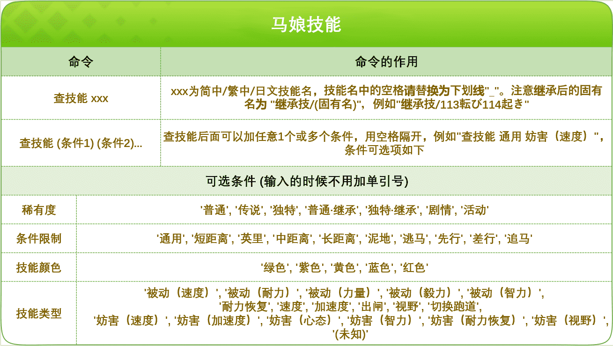

<!-- markdownlint-disable MD031 MD033 MD036 MD041 -->

<div align="center">

<a href="https://v2.nonebot.dev/store">
  
</a>

<p>
  
</p>

# UMA Plugin

_✨ [赛马娘 QQ 机器人插件](https://github.com/azmiao/uma_plugin/) NoneBot2 移植版 ✨_


<a href="https://pdm.fming.dev">
  
</a>
<!-- <a href="https://wakatime.com/badge/user/b61b0f9a-f40b-4c82-bc51-0a75c67bfccf/project/f4778875-45a4-4688-8e1b-b8c844440abb">
  
</a> -->

<br />

<a href="./LICENSE">
  
</a>
<a href="https://pypi.python.org/pypi/nonebot-plugin-uma">
  
</a>
<a href="https://pypi.python.org/pypi/nonebot-plugin-uma">
  
</a>

</div>

## 📖 介绍

这个插件是将在 hoshino bot 上安装的赛马娘攻略 nonebot

## 💿 安装

以下提到的方法 任选**其一** 即可

<details open>
<summary>[推荐] 使用 nb-cli 安装</summary>
在 nonebot2 项目的根目录下打开命令行, 输入以下指令即可安装

```bash
nb plugin install nonebot-plugin-uma
```

</details>

<details>
<summary>使用包管理器安装</summary>
在 nonebot2 项目的插件目录下, 打开命令行, 根据你使用的包管理器, 输入相应的安装命令

<details>
<summary>pip</summary>

```bash
pip install nonebot-plugin-uma
```

</details>
<details>
<summary>pdm</summary>

```bash
pdm add nonebot-plugin-uma
```

</details>
<details>
<summary>poetry</summary>

```bash
poetry add nonebot-plugin-uma
```

</details>
<details>
<summary>conda</summary>

```bash
conda install nonebot-plugin-uma
```

</details>

打开 nonebot2 项目根目录下的 `pyproject.toml` 文件, 在 `[tool.nonebot]` 部分的 `plugins` 项里追加写入

```toml
[tool.nonebot]
plugins = [
    # ...
    "nonebot_plugin_uma"
]
```

</details>

## ⚙️ 配置

暂无

## 🎉 使用

现有指令列表：

- `uma_skills` 模块：  
  

未来插件完善后将会对接 PicMenu，敬请期待

## 📞 联系

### \[策划 & 开发\] \[饼干的卑微仆人\] [黑纸折扇](https://github.com/Perseus037)

- QQ: 1209228678

### \[协助开发\] \[超级大饼干\] [student_2333](https://github.com/lgc2333)

- QQ：3076823485
- Telegram：[@lgc2333](https://t.me/lgc2333)
- 吹水群：[1105946125](https://jq.qq.com/?_wv=1027&k=Z3n1MpEp)
- 邮箱：<lgc2333@126.com>

## 💡 鸣谢

### [azmiao/uma_plugin](https://github.com/azmiao/uma_plugin/)

- 原 Hoshino 插件仓库  
  感谢原插件作者 [azmiao](https://github.com/azmiao)、[CYDXDianXian](https://github.com/CYDXDianXian)、[int-PP](https://github.com/int-PP)、[BossWangST](https://github.com/BossWangST) 的无私奉献！

### 最后……

- 感谢宇宙无敌爱慕织姬单推人，以及所有喜欢赛马娘的人

## 💰 赞助

感谢大家的赞助！你们的赞助将是我继续创作的动力！

- [爱发电](https://afdian.net/@lgc2333)
- <details>
    <summary>赞助二维码（点击展开）</summary>

  

  </details>

## 📝 更新日志

### 0.1.0.dev2

- 修复存在多个查询结果时无法正常出图的 Bug & 换用 `htmlrender` 渲染表格

### 0.1.0.dev1

- 移植了原插件的 `uma_skills` 模块
